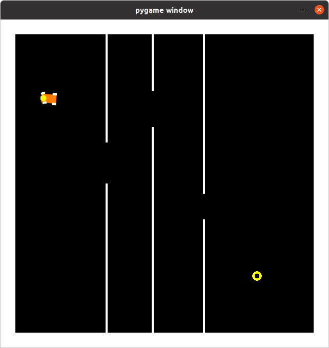

# Car Game Hack using Deep Q Network
playing a self-made car game using deep Q network 
## About the Game
   
The goal of the game is to drive the car to the target(yellow circle); The player will fail if the car hits a wall or the car failed to reach the target within a certain time. There are four actions: accelerate, decelerate/reverse, steering right, and steering left.  
The gaming is written using purely numpy and opencv, which means that rendering a frame is basically calculating a matrix base on the user's input and internal state hence it's freely efficient thanks to SIMD optimizations. You can play the game by execute `python3 ./run_game.py`(You need to have pygame installed to play the game. You can use arrow keys to drive the car.)

## Some Implementation Details
*  We cannot use a single frame of the game as the game state since some internal state of the car like velocity can't be inferred from a single image. Therefore the game state is represented in three consecutive frames.
* Some reward shaping techniques were used to improve the convergent speed since the original reward function was very sparse(1 when reached the target, 0 otherwise). While the algorithm still needs about 70 episodes to converge on the simplest game setup. In fact, DQN is not the best algorithm for this problem. Newer techniques like curiosity-driven learning might outperform DQN by a large margin on this sort of task 

